## 1. System Context diagram

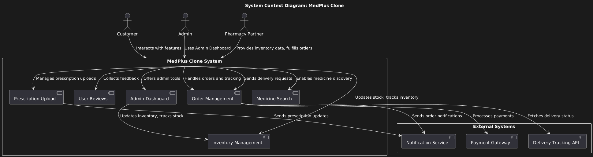

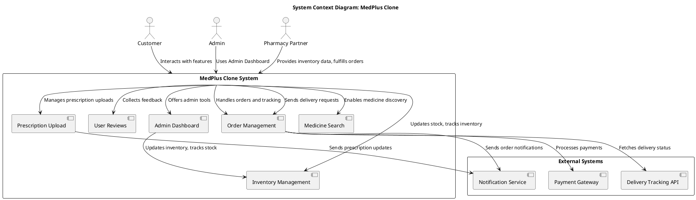

---

## 2. Container Diagram

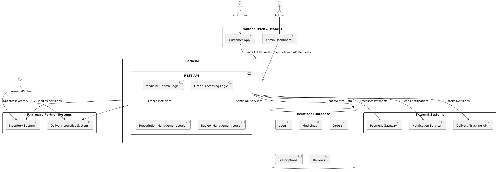

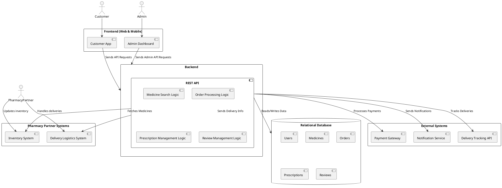

---

## 3. Component Diagram

### 3.1 Customer Component Diagram

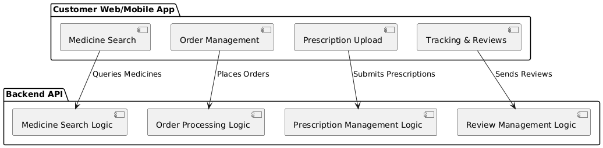

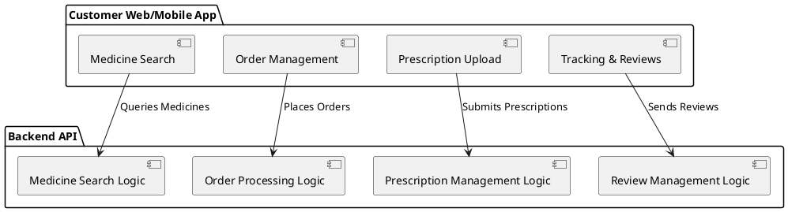

---

### 3.2 Admin Component Diagram

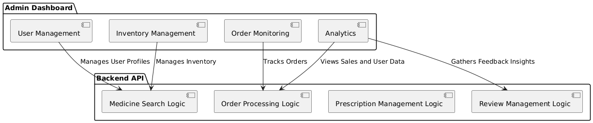

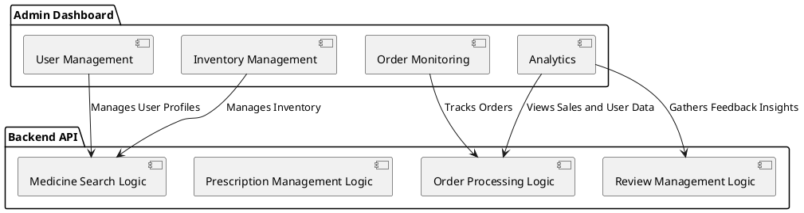

---

### 3.3 Pharmacy Partner Component Diagram

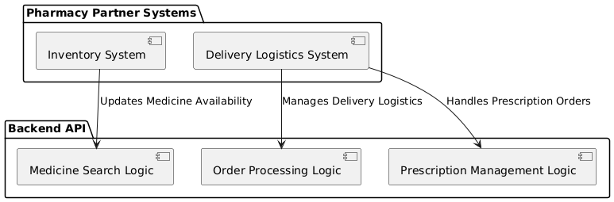

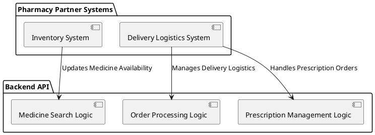

---

## 4. Deployment Diagram

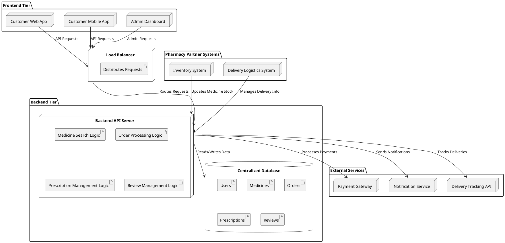

---

## 5. ER Diagram

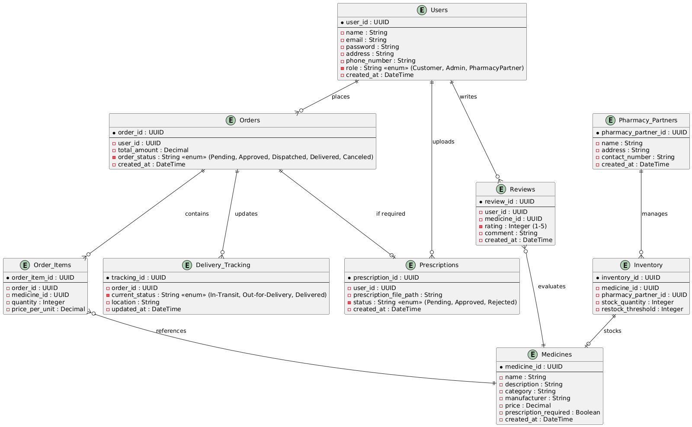

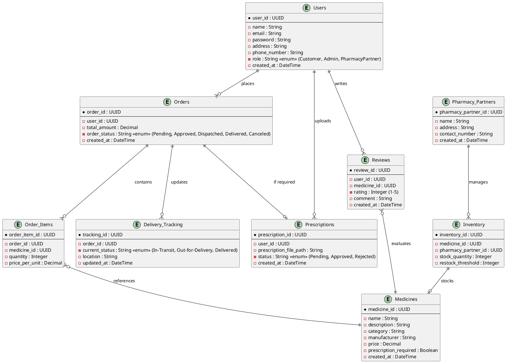

---