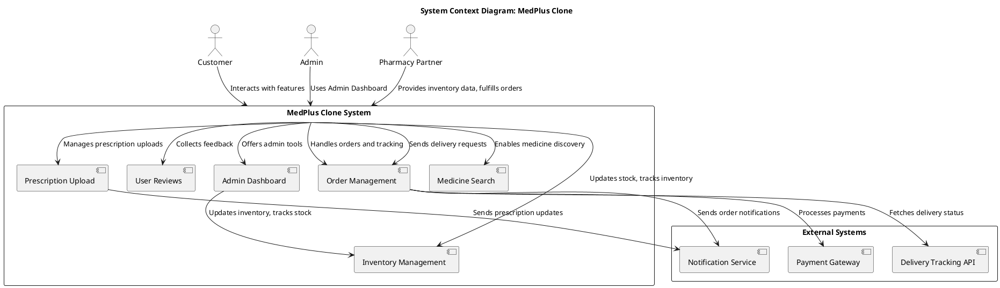

## 1. System Context diagram

```plantuml
@startuml
title System Context Diagram: MedPlus Clone

actor "Customer" as Customer
actor "Admin" as Admin
actor "Pharmacy Partner" as Partner

rectangle "MedPlus Clone System" as MedPlus {
  component [Medicine Search]
  component [Order Management]
  component [Prescription Upload]
  component [User Reviews]
  component [Admin Dashboard]
  component [Inventory Management]
}

' Customer Interactions
Customer --> MedPlus : Interacts with features
MedPlus --> [Medicine Search] : Enables medicine discovery
MedPlus --> [Order Management] : Handles orders and tracking
MedPlus --> [Prescription Upload] : Manages prescription uploads
MedPlus --> [User Reviews] : Collects feedback

' Admin Interactions
Admin --> MedPlus : Uses Admin Dashboard
MedPlus --> [Admin Dashboard] : Offers admin tools
[Admin Dashboard] --> [Inventory Management] : Updates inventory, tracks stock

' Pharmacy Partner Interactions
Partner --> MedPlus : Provides inventory data, fulfills orders
MedPlus --> [Inventory Management] : Updates stock, tracks inventory
MedPlus --> [Order Management] : Sends delivery requests

' External Systems
rectangle "External Systems" {
  component [Payment Gateway]
  component [Notification Service]
  component [Delivery Tracking API]
}

' External System Interactions
[Order Management] --> [Payment Gateway] : Processes payments
[Order Management] --> [Delivery Tracking API] : Fetches delivery status
[Order Management] --> [Notification Service] : Sends order notifications
[Prescription Upload] --> [Notification Service] : Sends prescription updates
@enduml
```

---

