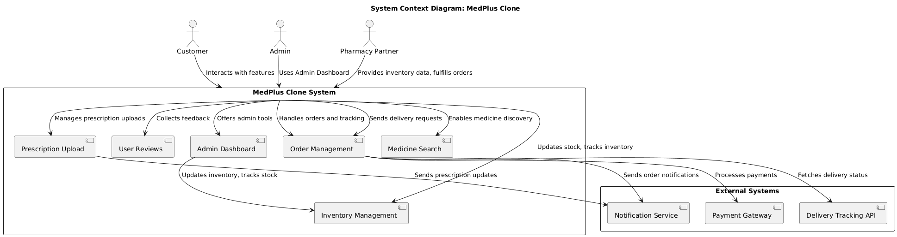
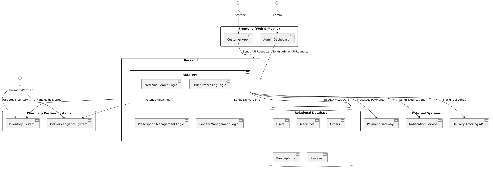
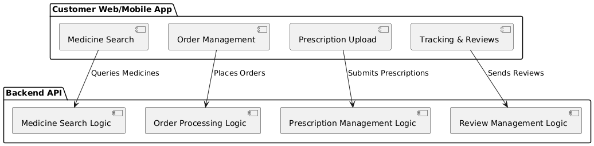
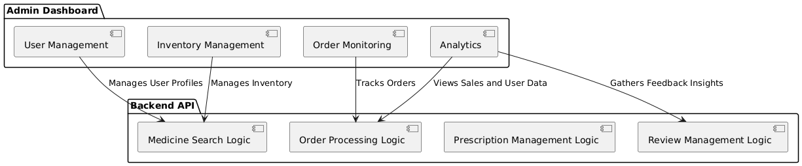
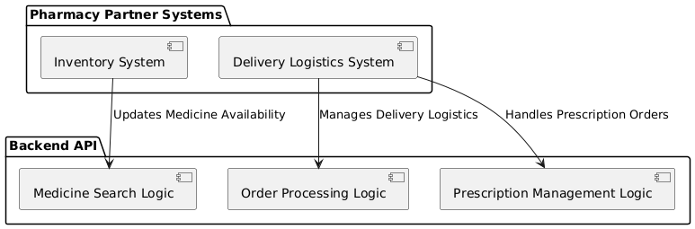
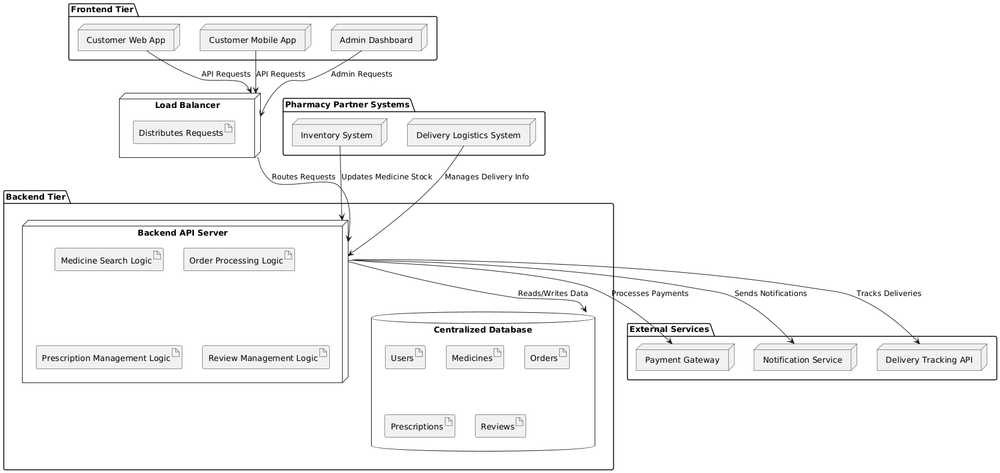
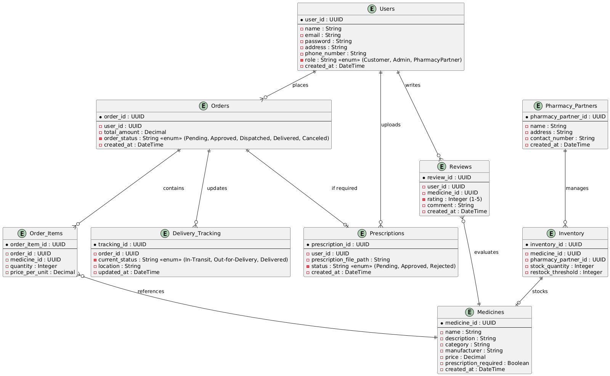

# System Design Document  
## MedPlus Clone  
**Version:** 1.0  
**Prepared By:** ArchiteKTs  
**Date:** 04-12-2024  

---

## Table of Contents  
1. [Introduction](#introduction)  
    1.1 [Purpose](#11-purpose)  
    1.2 [Scope](#12-scope)  
    1.3 [Definitions, Acronyms, and Abbreviations](#13-definitions-acronyms-and-abbreviations)  
2. [System Overview](#system-overview)  
3. [System Design](#system-design)  
    3.1 [Architectural Overview](#31-architectural-overview)  
    3.2 [C4 Model](#32-c4-model)  
        3.2.1 [System Context Diagram](#321-system-context-diagram)  
        3.2.2 [Container Diagram](#322-container-diagram)  
        3.2.3 [Component Diagrams](#323-component-diagrams)  
            - [Users](#users)  
            - [Admin](#admin)  
            - [Pharmacy Partners](#pharmacy-partners)  
        3.2.4 [Deployment Diagram](#324-deployment-diagram)  
4. [Database Design](#database-design)  
    4.1 [ER Diagram](#41-er-diagram)  
    4.2 [Schema Design](#42-schema-design)  
5. [External Interfaces](#external-interfaces)  
6. [Non-Functional Requirements Mapping](#non-functional-requirements-mapping)  
7. [Design Rationale](#design-rationale)  
8. [Conclusion](#conclusion)  

---

## 1. Introduction  

### 1.1 Purpose  
This document provides a detailed design description for the **MedPlus Clone** project, which aims to replicate and enhance the functionalities of the MedPlus platform. This design document follows **SWEBOK v4**'s guidelines to ensure the delivery of a professional and structured solution aligned with industry standards.

### 1.2 Scope  
The **MedPlus Clone** application is an e-commerce platform for pharmacy operations. It supports medicine search, prescription uploads, order placement, and tracking. It integrates various user types, including customers, admins, and pharmacy partners, and is built to support both mobile and web platforms.

### 1.3 Definitions, Acronyms, and Abbreviations  
- **Customer:** End-users of the platform who purchase medicines.  
- **Admin:** Platform managers responsible for inventory, orders, and analytics.  
- **Pharmacy Partners:** Third-party suppliers and logistics providers.  
- **API:** Application Programming Interface, enabling communication between system components.  
- **ER Diagram:** Entity-Relationship Diagram.  
- **PCI DSS:** Payment Card Industry Data Security Standard.  

---

## 2. System Overview  
The **MedPlus Clone** follows a client-server architecture, with distinct tiers for the frontend, backend, database, and third-party integrations. The architecture supports high scalability, fault tolerance, and modularity to accommodate future enhancements.

---

## 3. System Design  

### 3.1 Architectural Overview  
The system design is based on a layered architecture:  
1. **Frontend Layer:** User-facing interfaces for customers, admins, and pharmacy partners.  
2. **Backend Layer:** Contains business logic and API endpoints.  
3. **Data Layer:** Centralized database for storing user, medicine, and order information.  
4. **Integration Layer:** Interfaces with external services such as payment gateways, notification systems, and delivery APIs.  

---

### 3.2 C4 Model  

#### 3.2.1 System Context Diagram  
The System Context Diagram depicts the system's interactions with external entities.  
  

#### 3.2.2 Container Diagram  
The Container Diagram provides an overview of the system’s major containers and their interactions.  
  

#### 3.2.3 Component Diagrams  

- **Users Component Diagram**  
  

- **Admin Component Diagram**  
  

- **Pharmacy Partner Component Diagram**  
 

#### 3.2.4 Deployment Diagram  
The Deployment Diagram describes the physical deployment of system components.  
  

---

## 4. Database Design  

### 4.1 ER Diagram  
The database schema includes tables for Users, Medicines, Orders, Prescriptions, Reviews, and more.  
  

### 4.2 Schema Design  
| Table Name     | Description               | Key Columns                   |  
|----------------|---------------------------|-------------------------------|  
| **Users**      | Stores user information   | user_id (PK), email, password, address |  
| **Medicines**  | Stores medicine catalog   | medicine_id (PK), name, price, stock |  
| **Orders**     | Tracks customer orders    | order_id (PK), user_id (FK), total |  
| **Prescriptions** | Stores prescription data | prescription_id (PK), image_path |  
| **Reviews**    | Stores user reviews       | review_id (PK), rating, user_id (FK) |  
| **Pharmacy_Partners**  | Stores Pharmacy partners information | pharmacy_partner_id (PK), name, address |
| **Inventory** | Stores medicine stock data | inventory_id (PK), medicine_id (FK), stock_quantity  |
| **Delivery Tracking** |Tracks Delivery status | tracking_id (PK), order_id (FK), location |

---

## 5. External Interfaces  

### 5.1 Payment Gateway  
- **Purpose:** Securely process transactions.  
- **Protocol:** REST API over HTTPS.  
- **Response Time:** <500ms.  

### 5.2 Notification Service  
- **Purpose:** Push notifications for order updates and promotions.  
- **Protocol:** FCM and email-based API.  

### 5.3 Delivery API  
- **Purpose:** Real-time tracking of deliveries.  
- **Protocol:** REST API over HTTPS.  

---

## 6. Non-Functional Requirements Mapping  

| **NFR**         | **Implementation Details**                                  |  
|------------------|------------------------------------------------------------|  
| **Scalability**  | Load balancer to distribute traffic, horizontally scalable backend. |  
| **Security**     | Data encryption, PCI DSS-compliant payment processing.     |  
| **Performance**  | <2s response time for 95% of user interactions.            |  
| **Availability** | 99.9% uptime with failover mechanisms.                     |  

---

## 7. Design Rationale  
- **Modularity:** Separation of concerns ensures easy maintenance and testing.  
- **Extensibility:** Future features like pharmacy subscriptions or insurance integration can be easily added.  
- **Industry Standards:** Adheres to **SWEBOK v4** guidelines and **PCI DSS** for secure payment handling.  

---

## 8. Conclusion  
This document comprehensively outlines the system design for the MedPlus Clone, following industry standards for modularity, security, and scalability. It highlights how the system meets functional and non-functional requirements while providing a roadmap for implementation and testing. The design supports extensibility and ensures seamless interaction among customers, admins, and pharmacy partners. Moving forward, this serves as the foundational guide to building a robust and efficient pharmacy e-commerce platform.  