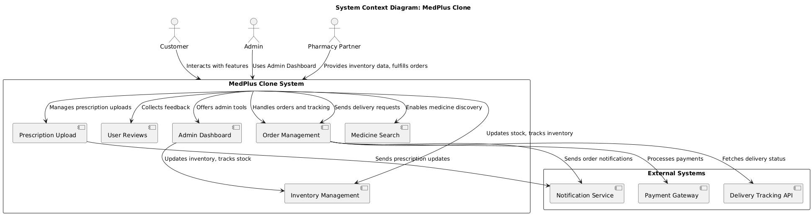
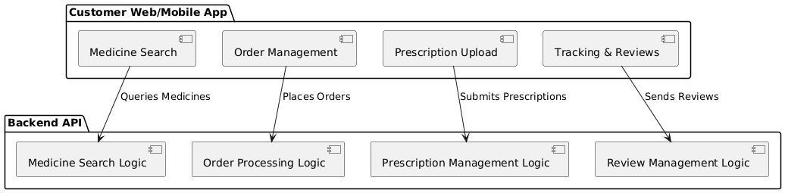

# Cross-Reference Matrix: MedPlus Clone

The Cross-Reference Matrix links functional and non-functional requirements specified in the Software Requirements Specification (SRS) to the corresponding components and features of the MedPlus Clone system, along with the related UML diagrams. This ensures traceability from requirements to design and implementation.

| Requirement ID | Requirement Description                                                             | System Component/Feature                            | Relevant UML Diagrams/Sections                                  |
|----------------|--------------------------------------------------------------------------------------|-----------------------------------------------------|---------------------------------------------------------------|
| *FR1*        | *User Registration and Authentication*: Users can register and log in securely.    | User Profile Management, Authentication             | System Context Diagram (Customer, Admin)   Container Diagram (Authentication)   Component Diagram (Admin, User Profile) |
| *FR2*        | *Medicine Search and Discovery*: Users can search for medicines based on name or category. | Medicine Search                                    | System Context Diagram (Customer, Medicine Search)   Container Diagram (Medicine Search)   Component Diagram (Customer) |
| *FR3*        | *Order Management*: Users can add medicines to the cart, place orders, and track them. | Order Management                                   | System Context Diagram (Customer, Admin, Order Management)   Container Diagram (Order Management)   Component Diagram (Admin, Customer) |
| *FR4*        | *Prescription Upload*: Users can upload prescriptions, which are verified by Admin. | Prescription Upload                                 | System Context Diagram (Customer, Admin, Prescription Upload)   Container Diagram (Prescription Upload)   Component Diagram (Admin, Customer) |
| *FR5*        | *Payment Processing*: Users can make payments through various methods (cards, UPI). | Payment Gateway, Order Management                   | Container Diagram (Payment Gateway)   Component Diagram (Customer, Admin, Pharmacy Partner) |
| *FR6*        | *Order Tracking*: Users can track the status of their orders in real-time.        | Delivery Tracking API, Order Management             | System Context Diagram (Customer, Delivery Tracking API, Order Management)   Container Diagram (Delivery Tracking API, Order Management)   Component Diagram (Customer, Pharmacy Partner) |
| *FR7*        | *User Reviews*: Users can rate and review medicines they have ordered.            | User Reviews                                        | System Context Diagram (Customer, User Reviews)   Container Diagram (User Reviews)   Component Diagram (Admin, Customer) |
| *FR8*        | *Admin Dashboard*: Admins can manage inventory, track orders, and update catalogs. | Admin Dashboard, Inventory Management               | System Context Diagram (Admin, Admin Dashboard)   Container Diagram (Admin Dashboard)   Component Diagram (Admin) |
| *FR9*        | *Inventory Management*: Pharmacy partners can manage medicine stock and fulfill orders. | Inventory Management, Pharmacy Partner              | Component Diagram (Pharmacy Partner) |
| *FR10*       | *Order Confirmation*: Users are notified of order status via email/SMS.           | Notification Service, Order Management              | System Context Diagram (Customer, Order Management, Notification Service)   Container Diagram (Notification Service)   Component Diagram (Admin, Pharmacy Partner, Customer) |
| *FR11*       | *Prescription Verification*: Admins verify prescriptions before processing orders. | Prescription Upload, Admin Dashboard                | Component Diagram (Admin) |
| *NR1*        | *Scalability*: System must handle high traffic without performance degradation.    | Backend API Service, Database                       | Deployment Diagram (Backend API, Database) |
| *NR2*        | *Security*: Sensitive data must be encrypted, and multi-layered security must be in place. | Authentication, Payment Gateway, Prescription Upload | Container Diagram (Authentication, Payment Gateway, Prescription Upload)   Component Diagram (Admin, Customer, Pharmacy Partner) |
| *NR3*        | *Performance*: The system must respond to user actions in under 2 seconds.        | Backend API Service, Frontend Application           | Container Diagram (Backend API Service, Frontend Application) |
| *NR4*        | *Availability*: The system must have 99.9% uptime with backup and failover mechanisms. | Database, Backend API Service                       | Deployment Diagram (Database, Backend API) |
| *NR5*        | *Compliance*: The system must adhere to regulatory standards (e.g., GDPR, PCI DSS). | Payment Gateway, Prescription Upload                | Component Diagram (Payment Gateway, Prescription Upload) |
| *NR6*        | *Usability*: The system must provide a user-friendly interface for both customers and admins. | Frontend Application, Admin Dashboard               | System Context Diagram (Customer, Admin)   Container Diagram (Frontend Application, Admin Dashboard) |

---

## UML Diagram References:

### 1. *System Context Diagram*:
   - Describes the interaction of all actors (Customer, Admin, Pharmacy Partners) with the MedPlus Clone system, including external systems like Payment Gateway and Delivery Tracking API.
   - *Relevant Diagrams*:
    

### 2. *Container Diagram*:
   - Provides a high-level view of the system architecture, including containers like the frontend application, backend API service, and database.
   - *Relevant Diagrams*:
    

### 3. *Component Diagrams*:
   - Describes the components within each container, such as Medicine Search, Order Management, Payment Gateway, Admin Dashboard, etc., and their interactions with actors (Customer, Admin, Pharmacy Partner).
   - *Relevant Diagrams*:
    
    
    

### 4. *Deployment Diagram*:
   - Describes the physical deployment of the system components, including the backend service, database, external services (Payment Gateway, Notification Service), and user-facing applications (Web, Android, iOS).
   - *Relevant Diagrams*:
    

### 5. *ER Diagram*:
   - Describes the database schema, including entities like Users, Orders, Medicines, Inventory, and Prescriptions.
   - *Relevant Diagrams*:
    

---

### Notes:
- *FR*: Functional Requirements
- *NR*: Non-Functional Requirements
- The *UML Diagrams* section provides direct links to the corresponding diagrams, ensuring that each requirement is traceable to the system components and design.

This matrix is designed to ensure that all requirements are properly addressed in the design and are easily traceable to their respective UML diagrams, facilitating easier verification during development and testing.